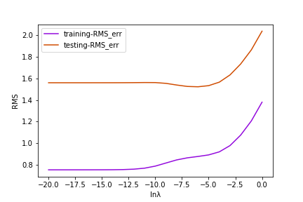
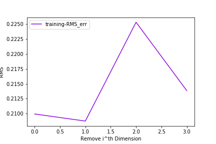

# Machine Learning hw1 <span style="color:red"></span>
Author: 洪彗庭 </br>
Student ID: A061610 

## Overview
In this homework, we are going to deal with 3 mathematical problems and 2 programming problems. The former 3 problems is finished in hand-written format, and this repository mainly show the result of the latter 2 programming problems' result. 

#### Files: </br>
* [hw1-1.pdf](./hw1-1.pdf): for solving Jensen's Inequality.
* [hw1-2.pdf](./hw1-2.pdf): for solving Entropy of the Univariate Gaussian.
* [hw1-3.pdf](./hw1-3.pdf): for solving KL divergence between two Gaussians.
* [hw1-4-polynomial-curve-fitting.ipynb](./hw1-4_polynomial_curve_fitting.ipynb): for solving Polynomial Curve Fitting problem. </br>
* [hw1-5-polynomial-regression.ipynb](./hw1-5_polynomial_regression.ipynb): for solving Polynomial Regression problem. </br>
* [environment.yml](./environment.yml): build conda environment to avoid tedious dependencies problem.

## Setup

* python 3.6.2
* scipy 0.19.1 (for loading the .mat files)
* numpy 1.13.1
* ipython

#### Other Packages
* pandas

To avoid tedious dependencies problem, I will recommand you to use [Anaconda](https://anaconda.org/) to create a small custom environment as follows:

```
conda env create -f environment.yml
# activate the environment
source activate ML_hw1
# deactivate when you want to leave the environment
source deactivate ML_hw1
```

## Results and Discussions
### Problem 4 : Polynomial Curve Fitting
* Root-Mean-Square error evaluated on traning set and testing set. (Order, M,  range from 1 to 9)
<p align="center"></p>

As the figure shows, We believe when order goes to 7 or more will cause the overfitting problem. (more detail discussion please refer to the [report](./report.pdf)).
 
* Training and testing Root-Mean-Square error in regularized case. (Order, M,  fix to 9; Regularized term, lnλ, range from -20 to 0)
<p align="center"></p>


More Detail discussion of the effect of λ please also refer to the [report](./report.pdf).

### Problem 5 : Polynomial Regression
* Root-Mean-Square error evaluated on **multi-dimension** traning set and testing set. (Order, M, fix to 1 and 2)
<p align="center"></p>

As the figure shows, when order increases, the RMS error will decrease.
 
* Training Root-Mean-Square error of different attribute. (Selected dimension range from 0th to 3th)
<p align="center"></p>	

As the figure shows, we will select the 2nd dimension as the most contributive attribute, since without 2nd dimension, it achieves the highest(worst) RMS error on the traning set. More detail please also refer to the [report](./report.pdf).


## Implementation
### - Data 
The data provided in this assigment are as follows:

* problem-4 : **1-dimension** data


|| target(label) | data|
|-------|----------|-------|
| training(# 20)| 1.976161</br> -1.016098</br> ...  | 6.283185 </br> 4.983216 </br> ...|
| testing(# 10)| -4.433719</br> -0.695587</br> ...  | 2.383277 </br> 5.199877 </br> ... |

* problem-5 : **4-dimension** data </br>
(3-classes, # of 50 data per class)</br>
(traning: first 80% of data in each class)</br>
(testing: last 20% of data in each class)


|| target(label) | data|
|-------|----------|-------|
| training(# 120)|1 </br> 1</br> ...</br>2</br> 2</br> ...</br>3</br> 3</br> ...   | [ 5.1  3.5  1.4  0.2] </br> [ 4.9  3.   1.4  0.2] </br> ...</br>[ 7.   3.2  4.7  1.4]</br>[ 6.4  3.2  4.5  1.5]</br>...</br>[ 6.3  3.3  6.   2.5]</br>[ 5.8  2.7  5.1  1.9]</br> ...|
| testing(# 30)| 1</br> 1</br> ...</br>2</br> 2</br> ...</br>3</br> 3</br> ...  | [ 5.   3.5  1.3  0.3]</br>[ 4.5  2.3  1.3  0.3] </br> ...</br>[ 5.5  2.6  4.4  1.2]</br>[ 6.1  3.   4.6  1.4]</br>...</br>[ 6.7  3.1  5.6  2.4]</br>[ 6.9  3.1  5.1  2.3]</br> ... |


### - Solve the Best Weight
### Recall:
Recall that in this assignment we define the polynomial as :

<p align="center"></p>

which the dot above the variable means it could be a vector.</br>


Suppose now we fix the order of polynomial(M) to be **2**.</br>
Therefore when the **dimension of x is 1**, we will write the function as :

<p align="center"></p>

when the **dimension of x is D**, we will write the function as :

<p align="center"></p>

The key point here is we want to solve **the best W**, which is actually the positioin in coordinate system spanned by the basis, Φ.</br>
The Φ is defined as : </br>

<p align="center"></p>

which Φ(x) equals to: </br> 

<p align="center"></p>

There are two ways to solve the **W**, one is using [batch learning](./img/bt_learning.png), the other is using [sequential learning](./img/sq_learning.png)(or called Online learning).</br></br>

### Solve:
Here both in problem 4 and 5, I solve **W** by **batch-learning**.</br>

* **non-regularized error function**:

<p align="center"></p>

The solution formula would be like follows:

<p align="center"></p>

which t is the target(label).

* **regularized error function**:

<p align="center"></p>

The solution formula would be then like follows:

<p align="center"></p>

which t is also the target(label).

**For more details on coding implementation and results please refer to** </br>
[hw1-4-polynomial-curve-fitting.ipynb](./hw1-4_polynomial_curve_fitting.ipynb)</br>
[hw1-5-polynomial-regression.ipynb](./hw1-5_polynomial_regression.ipynb)</br>


## Reference
- Notes taken in class

- [numpy linalg library](https://docs.scipy.org/doc/numpy-1.13.0/reference/generated/numpy.linalg.pinv.html)

- [wiki of batch-learninf](https://en.wikipedia.org/wiki/Online_machine_learning)

- [markdown cheet sheet](http://csrgxtu.github.io/2015/03/20/Writing-Mathematic-Fomulars-in-Markdown/)
